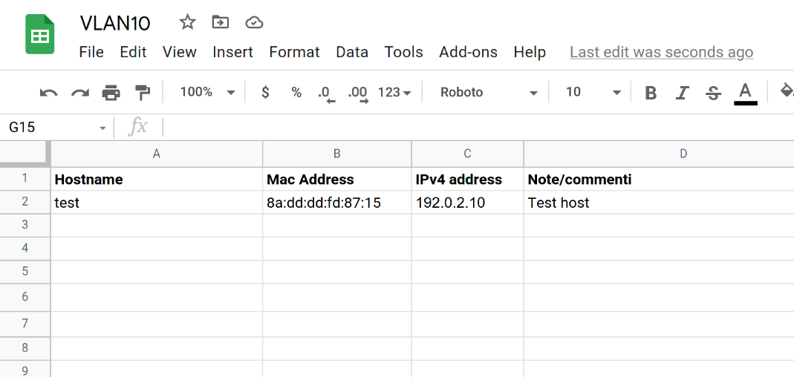

# GSheets VLAN generator

This scripts can:
1. Retrieve a list of hostnames/MAC addresses/IP addresses from different Google Sheets files (one per VLAN).
2. Validate that list.
3. Generate automatically a leases configuration for an [ISC DHCPd](https://www.isc.org/dhcp/) server.
4. Synchronize a MySQL database of authorized Mac Addresses, to be read by [FreeRADIUS](https://freeradius.org/), suitable for Mac authentication.

## Usage

This software is divided into two files:
- A module [vlan.py](vlan.py), defining a `Vlan` class. This class makes all the low-level operations (retrieve data from Google, validate data, build config).
  This module uses [gspread](https://pypi.org/project/gspread/) to retrieve data from Google Sheets.
- A command-line script [vlan_config_generator.py](vlan_config_generator.py) to automatically run those operations in a Linux-based environment.

The script can be used with the following options:
```bash
$ ./vlan_config_generator.py -h
usage: vlan_config_generator.py [-h] [-o DIR] [-c JSON_LIST_VLANS] [-d JSON_MYSQL_SETTINGS] [-l LOG_FILE] [-v]

Generate a set of ISC DHCPd configuration files and synchronize FreeRADIUS from Google Sheets files.

optional arguments:
  -h, --help            show this help message and exit
  -o DIR, --output-dir DIR
                        Output dir for DHCPd configuration files.
  -c JSON_LIST_VLANS, --list-vlans JSON_LIST_VLANS
                        JSON-formatted list of VLANs.
  -d JSON_MYSQL_SETTINGS, --mysql-settings JSON_MYSQL_SETTINGS
                        JSON-formatted MySQL settings.
  -l LOG_FILE, --log-file LOG_FILE
                        Log file.
  -v, --verbose         Be verbose.
```

### Google Sheet format
The Google Sheet file *must* have the following structure:
- On each row there's a single host to be registered.
- The first row contains the labels of each column.
- At least, the following columns must be present: `Hostname`, `Mac Address`, `IPv4 address` and `Note/commenti`.
- Everything else is ignored.

Each row containing an hostname, a MAC address and an IPv4 address is evaluated. Others are discarded.
If any hostname, MAC Address or IPv4 address is not valid, the software triggers an error and it
skips **the entire VLAN**. This is meant to always have a consistent and fully-valid DHCPd configuration for every VLAN,
even if the configuration is slightly outdated.



## Installation with Docker
This software has been designed to be run periodically (e.g. with systemd timers) using a [Docker](https://www.docker.com/) container.

1. Create a Google Service account with read access to the wanted Google Sheets file, and download the credentials into a JSON
   file called `service_account.json`. You can follow the steps from the Gspread documentation: https://gspread.readthedocs.io/en/latest/oauth2.html.
2. Install the latest version of Docker CE for your distribution: https://docs.docker.com/engine/install/.
3. Create a Docker [volume](https://docs.docker.com/storage/volumes/), which will contain:
   - The configuration file, with the list of VLANs and their associated Google Sheets file.
   - The MySQL settings.
   - The output DHCPd configuration files.
```bash
docker volume create gsheets-vlan-gen   
```
4. Create JSON file with the list of the VLANs and their associated informations. This file will be called `list_vlans.json`. For example, you can edit the [example_list_vlans.json](example_list_vlans.json) file:
```json
[
    {
        "vlan_id": 999,
        "ip_network": "192.0.2.0/24",
        "sheet_name": "TEST_VLAN999",
        "dhcpd_out_file": "vlan_999.conf",
        "allow_duplicated_ip": true,
        "comment": "Test VLAN 999"    
    },
    [...]
]
```
5. Create a JSON file with the MySQL server settings. This file will be called `mysql_settings.json`. For example, you can edit the [example_mysql_settings.json](example_mysql_settings.json) file:
```json
{
    "database": "radius",
    "host": "radius.example.com",
    "password": "password",
    "user": "radius"
}
```
This user requires `SELECT`, `INSERT` and `DELETE` permissions over the `radreply` and `radcheck` tables. If you trust this
scripts, you can simply grant all privileges to the user. Assuming that this script is run on the `myserver.example.com` server:
```sql
CREATE USER 'radius'@'myserver.example.com' IDENTIFIED BY 'password';
GRANT SELECT, INSERT, DELETE ON radius.radreply TO 'radius'@'myserver.example.com';
GRANT SELECT, INSERT, DELETE ON radius.radcheck TO 'radius'@'myserver.example.com';
```
6. Copy the JSON files containing the list of VLANs and the MySQL connection settings to the Docker volume created before. E.g.:
```bash
cp list_vlans.json /var/lib/docker/volumes/gsheets-vlan-gen/_data
cp mysql_settings.json /var/lib/docker/volumes/gsheets-vlan-gen/_data
```
7. Clone this repository and build a Docker image
```bash
docker build -t gsheets-vlan-gen .
```
8. Once created the image, you can *manually* build the new configurations with the following command:
```bash
docker run --rm -v gsheets-vlan-gen:/var/lib/vlan-config-gen gsheets-vlan-gen
```
  The files and the logfile will be created inside the Docker volume, i.e. in `/var/lib/docker/volumes/gsheets-vlan-gen`.
9. The command written previously can be scripted, e.g. using crontab, to periodically generate new configuration.

### Periodic update with systemd timer
A good solution is the use of [systemd timers](https://wiki.archlinux.org/index.php/Systemd/Timers) to periodically
update the configuraiton files. In the `systemd` directory there are scripts to help doing so. To install them:
1. Copy `gsheets-vlan-gen.service` and `gsheets-vlan-gen.timer` to `/etc/systemd/system`.
2. Copy `gsheets-vlan-gen.sh` to `/usr/local/bin`.
3. Reload systemd:
```bash
systemctl daemon-reload
```
4. Enable systemd timer
```bash
systemctl --now enable gsheets-vlan-gen.timer
```

## Other documentation
- An example of [FreeRADIUS](https://freeradius.org/) configuration for this project is available on [radius.md](docs/radius.md).
- An example of configuration for [ArubaOS-CX](https://www.arubanetworks.com/products/switches/) switches and
  [MikroTik](https://mikrotik.com/) devices is available on [network-devices.md](docs/network-devices.md).
- A script to periodically clean the RADIUS accounting table `radacct` is documented on [clean-radacct.md](docs/clean-radacct.md).

## License and copyright
Copyright &copy; 2021-2022 Istituto Nazionale di Ricerca Metrologica (INRiM). For information contact Dario Pilori <d.pilori@inrim.it>.

This software (and the associated documentation) is released under a [MIT License](https://opensource.org/licenses/MIT).

## Contacts
- Dario Pilori (d.pilori@inrim.it)